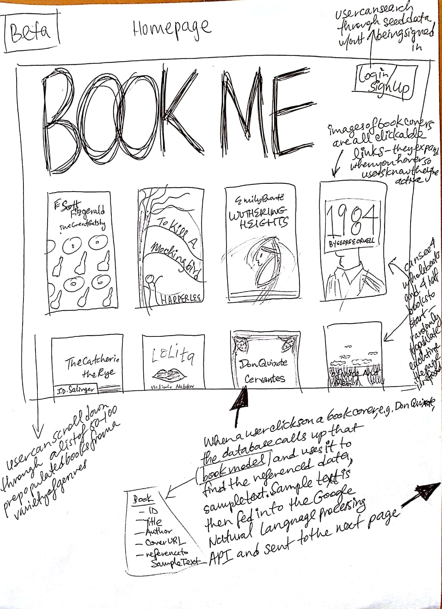
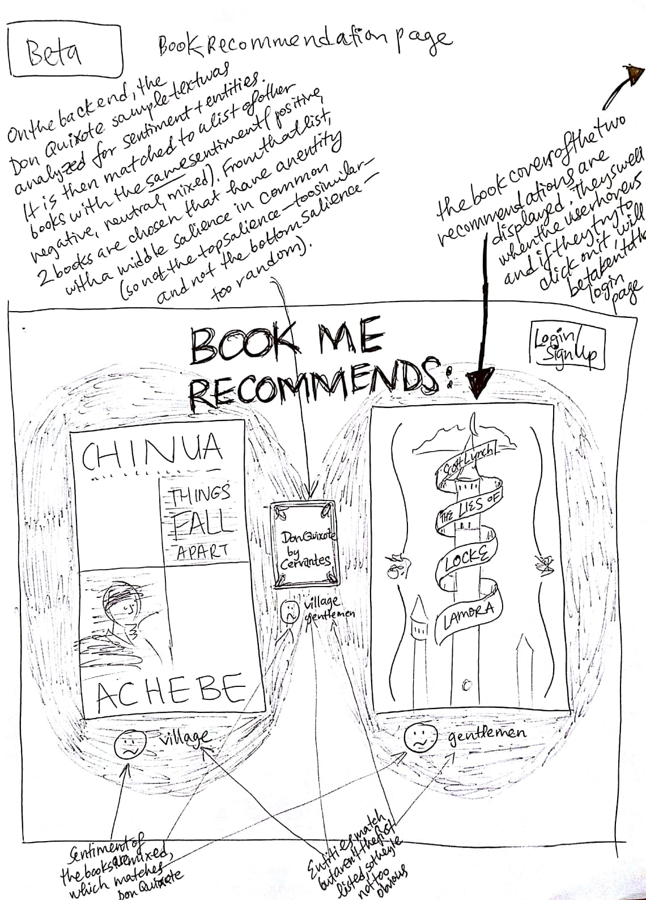
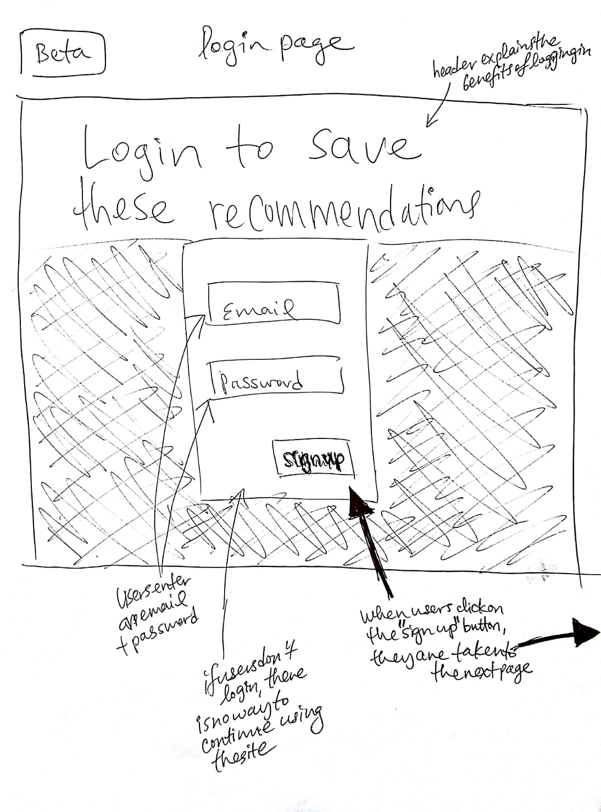
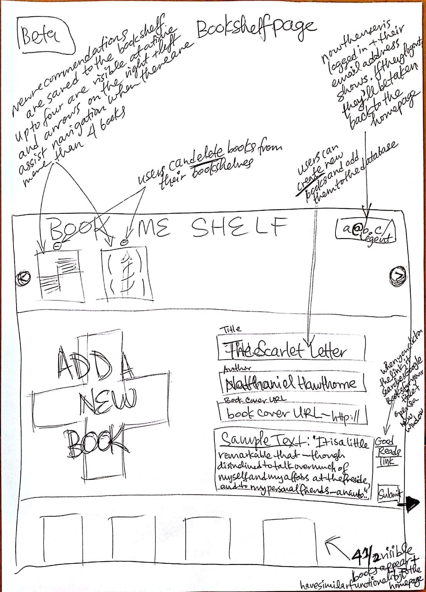
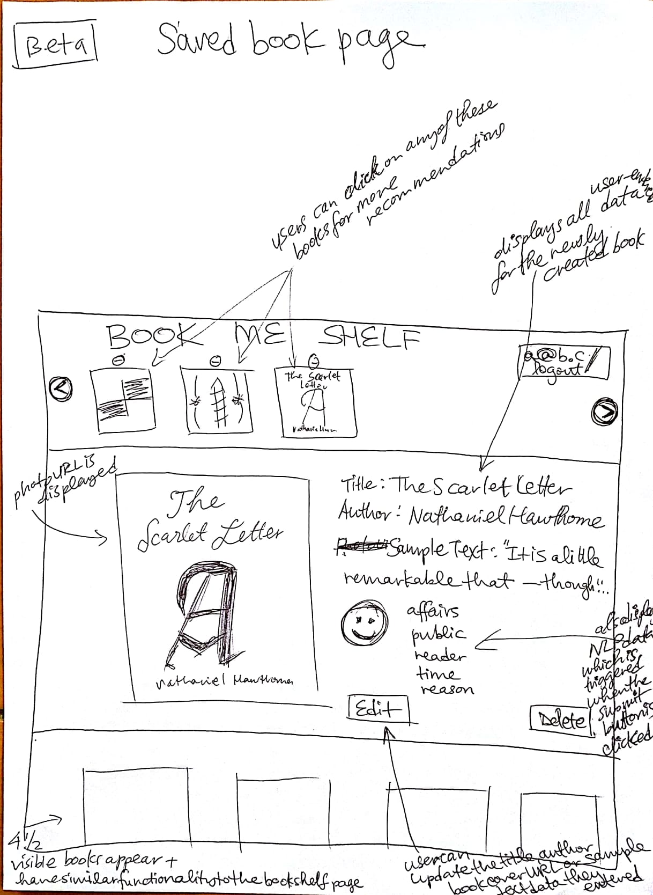
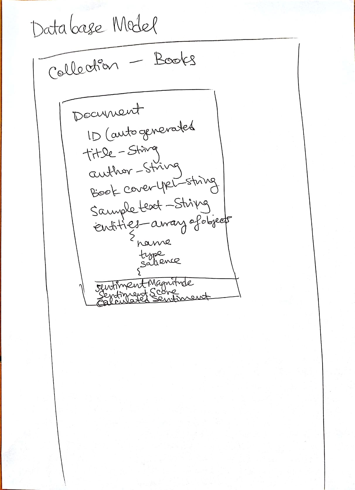

# BookMe

## Technologies used:
```

```

## Approach taken:
```

```

## Installation instructions:
```

```

## Unsolved problems:
```

```
------------------------------------------------------------------------

## Other useful links:

* Presentation slides: 

* Trello board link: 

## Wireframes: 






## Database model: 
